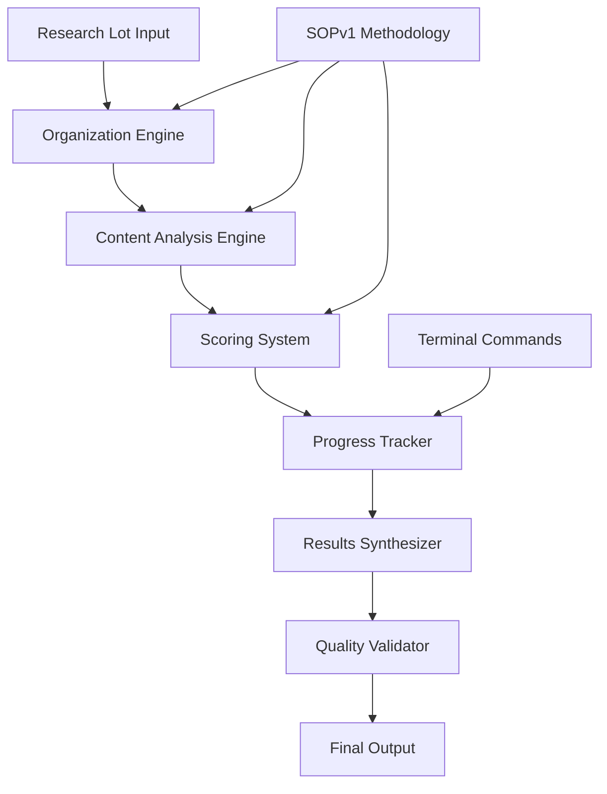

# Design Document

## Overview

The Rust Library Discovery System implements a systematic approach to identifying high-value Rust library opportunities from diverse technical content. The system follows the SOPv1 methodology with a three-phase process: ORGANIZE, ANALYZE, and SYNTHESIZE. It processes research lots containing millions of lines of technical content and extracts actionable library concepts scoring 8-10/10 across three critical dimensions.

The design emphasizes terminal-based operations, systematic chunk processing, and rigorous quality assurance to ensure reliable identification of library concepts with strong market potential and technical feasibility.

## Architecture

### High-Level Architecture



### System Components

1. **Research Lot Manager**: Handles file organization, deduplication, and directory structure
2. **Content Analysis Engine**: Processes 1000-line chunks and extracts library concepts
3. **Three-Dimensional Scoring System**: Evaluates concepts on PMF, Testing, and Differentiation
4. **Progress Tracking System**: Terminal-based progress monitoring and validation
5. **Results Synthesizer**: Compiles and ranks discovered concepts
6. **Quality Assurance Module**: Validates analysis integrity and completeness

## Components and Interfaces

### Research Lot Manager

**Purpose**: Organizes raw research content into structured, analyzable format

**Key Interfaces**:
- `organize_research_lot(lot_number: u32) -> Result<LotStructure, Error>`
- `detect_duplicates(input_path: &Path) -> Result<DuplicationReport, Error>`
- `convert_to_txt(file_path: &Path) -> Result<PathBuf, Error>`
- `validate_organization(lot_path: &Path) -> Result<ValidationReport, Error>`

**Responsibilities**:
- Create standard directory structure (TxtInput##/, NonTxtInput##/, Progress##/, Output##/, Duplicates##/)
- Convert diverse file formats to standardized .txt with naming convention
- Perform MD5-based duplicate detection and removal
- Generate file statistics and organization reports

### Content Analysis Engine

**Purpose**: Systematically processes content in manageable chunks to extract library concepts

**Key Interfaces**:
- `analyze_chunk(file_path: &Path, start_line: usize, end_line: usize) -> Result<ChunkAnalysis, Error>`
- `filter_relevance(content: &str) -> ContentRelevance`
- `extract_concepts(relevant_content: &str) -> Vec<LibraryConcept>`
- `classify_content_domain(content: &str) -> TechnologyDomain`

**Responsibilities**:
- Process files in 1000-line chunks for systematic coverage
- Filter programming-relevant content from non-technical material
- Extract potential library concepts with detailed descriptions
- Categorize content by technology domain (React, WASM/Rust, etc.)

### Three-Dimensional Scoring System

**Purpose**: Evaluates library concepts on critical success dimensions

**Key Interfaces**:
- `score_pmf_probability(concept: &LibraryConcept) -> Score`
- `score_testing_ease(concept: &LibraryConcept) -> Score`
- `score_differentiation_potential(concept: &LibraryConcept) -> Score`
- `validate_scores(concept: &ScoredConcept) -> Result<(), ValidationError>`

**Scoring Criteria**:

**PMF Probability (1-10)**:
- 9-10: Critical widespread pain points, developers actively searching
- 7-8: Common problems with clear market demand
- 5-6: Nice-to-have solutions for niche audiences
- 1-4: Limited market need or novelty

**Ease of Testing (1-10)**:
- 9-10: Deterministic behavior, clear I/O, comprehensive test coverage possible
- 7-8: Testable with setup, manageable complexity
- 5-6: Testing possible but complex/integration-heavy
- 1-4: Difficult to test reliably, non-deterministic

**Differentiation Potential (1-10)**:
- 9-10: Truly innovative, no direct competitors, 10x improvement
- 7-8: Clear advantages, unique features/approaches
- 5-6: Incremental improvements over existing solutions
- 1-4: Me-too products, crowded space

### Progress Tracking System

**Purpose**: Terminal-based progress monitoring with data integrity guarantees

**Key Interfaces**:
- `update_chunk_status(file: &str, chunk: usize, status: ChunkStatus) -> Result<(), Error>`
- `get_completion_stats() -> CompletionStats`
- `validate_progress_integrity() -> Result<IntegrityReport, Error>`
- `generate_repository_status() -> RepositoryStatus`

**Terminal Commands Integration**:
- `find ResearchLot##/TxtInput##/ -name "*.txt" | wc -l` for file counting
- `grep -c "\[x\]" Progress##/use-case-analysis.md` for completed chunks
- `grep -c "\[ \]" Progress##/use-case-analysis.md` for remaining chunks
- `./SOP/tree-with-wc.sh` for comprehensive repository monitoring

### Results Synthesizer

**Purpose**: Compiles and ranks all discovered library concepts

**Key Interfaces**:
- `compile_use_cases(lot_path: &Path) -> Result<Vec<UseCaseEntry>, Error>`
- `rank_concepts(concepts: Vec<ScoredConcept>) -> RankedList`
- `categorize_by_domain(concepts: &[ScoredConcept]) -> DomainCategories`
- `generate_final_report(ranked_concepts: &RankedList) -> FinalReport`

**Output Structure**:
- Comprehensive use case catalog with 5-line descriptions
- Parallel analysis showing cross-domain similarities
- Technology domain categorization
- Strategic recommendations for development priorities

## Data Models

### Core Data Structures

```rust
#[derive(Debug, Clone)]
pub struct ResearchLot {
    pub number: u32,
    pub base_path: PathBuf,
    pub structure: LotStructure,
    pub statistics: LotStatistics,
}

#[derive(Debug, Clone)]
pub struct LotStructure {
    pub txt_input: PathBuf,
    pub non_txt_input: PathBuf,
    pub progress: PathBuf,
    pub output: PathBuf,
    pub duplicates: PathBuf,
}

#[derive(Debug, Clone)]
pub struct LibraryConcept {
    pub id: String,
    pub title: String,
    pub description: String,
    pub domain: TechnologyDomain,
    pub source_file: String,
    pub source_lines: (usize, usize),
    pub parallel_analysis: Vec<String>,
}

#[derive(Debug, Clone)]
pub struct ScoredConcept {
    pub concept: LibraryConcept,
    pub pmf_score: Score,
    pub testing_score: Score,
    pub differentiation_score: Score,
    pub combined_score: f64,
    pub scoring_rationale: ScoringRationale,
}

#[derive(Debug, Clone)]
pub struct Score {
    pub value: u8, // 1-10
    pub reasoning: String,
    pub confidence: f64, // 0.0-1.0
}

#[derive(Debug, Clone)]
pub enum TechnologyDomain {
    ReactEcosystem,
    WasmRustPerformance,
    ProgrammingLanguages,
    RuntimeSystems,
    ZigPatterns,
    SystemsProgramming,
    DeveloperTools,
    Other(String),
}

#[derive(Debug, Clone)]
pub enum ContentRelevance {
    HighlyRelevant,
    ModeratelyRelevant,
    LowRelevance,
    Irrelevant(String), // reason for irrelevance
}

#[derive(Debug, Clone)]
pub struct ChunkAnalysis {
    pub file_path: PathBuf,
    pub chunk_range: (usize, usize),
    pub relevance: ContentRelevance,
    pub extracted_concepts: Vec<LibraryConcept>,
    pub analysis_notes: String,
}
```

### Progress Tracking Models

```rust
#[derive(Debug, Clone)]
pub struct CompletionStats {
    pub total_files: usize,
    pub completed_files: usize,
    pub total_chunks: usize,
    pub completed_chunks: usize,
    pub completion_percentage: f64,
    pub estimated_remaining_time: Option<Duration>,
}

#[derive(Debug, Clone)]
pub enum ChunkStatus {
    NotStarted,
    InProgress,
    Completed,
    Skipped(String), // reason for skipping
}

#[derive(Debug, Clone)]
pub struct RepositoryStatus {
    pub total_files: usize,
    pub file_breakdown: HashMap<String, usize>, // directory -> count
    pub content_statistics: ContentStats,
    pub integrity_status: IntegrityStatus,
}
```

## Error Handling

### Error Categories

1. **File System Errors**: Missing files, permission issues, disk space
2. **Content Processing Errors**: Malformed content, encoding issues
3. **Scoring Validation Errors**: Invalid scores, missing rationale
4. **Progress Tracking Errors**: Inconsistent state, corrupted tracking files
5. **Terminal Command Errors**: Command execution failures, parsing errors

### Error Recovery Strategies

- **Graceful Degradation**: Continue processing other chunks if one fails
- **Automatic Retry**: Retry failed operations with exponential backoff
- **State Recovery**: Restore from last known good state
- **Detailed Logging**: Comprehensive error context for debugging
- **User Notification**: Clear error messages with suggested actions

### Error Types

```rust
#[derive(Debug, thiserror::Error)]
pub enum DiscoveryError {
    #[error("File system error: {0}")]
    FileSystem(#[from] std::io::Error),
    
    #[error("Content processing error: {message}")]
    ContentProcessing { message: String },
    
    #[error("Scoring validation error: {concept_id} - {issue}")]
    ScoringValidation { concept_id: String, issue: String },
    
    #[error("Progress tracking error: {0}")]
    ProgressTracking(String),
    
    #[error("Terminal command error: {command} - {error}")]
    TerminalCommand { command: String, error: String },
    
    #[error("Data integrity error: {0}")]
    DataIntegrity(String),
}
```

## Testing Strategy

### Unit Testing

**Content Analysis Engine**:
- Test chunk processing with various content types
- Validate concept extraction accuracy
- Test relevance filtering with edge cases
- Verify domain classification correctness

**Scoring System**:
- Test scoring algorithms with known good/bad examples
- Validate score consistency across similar concepts
- Test edge cases and boundary conditions
- Verify scoring rationale generation

**Progress Tracking**:
- Test terminal command integration
- Validate progress calculation accuracy
- Test state persistence and recovery
- Verify integrity checking

### Integration Testing

**End-to-End Workflow**:
- Process complete research lot from organization to synthesis
- Validate data flow between components
- Test error handling and recovery
- Verify output quality and completeness

**Terminal Integration**:
- Test all SOPv1 terminal commands
- Validate file counting accuracy
- Test progress monitoring commands
- Verify repository status reporting

### Performance Testing

**Scalability**:
- Test with large research lots (50,000+ lines)
- Measure processing time per chunk
- Test memory usage with large files
- Validate concurrent processing capabilities

**Quality Assurance**:
- Test scoring consistency across multiple runs
- Validate concept extraction reproducibility
- Test duplicate detection accuracy
- Verify data integrity maintenance

### Test Data Strategy

**Synthetic Test Data**:
- Create controlled content samples for each domain
- Generate edge cases for scoring validation
- Create malformed content for error testing
- Build regression test suites

**Real Data Validation**:
- Use ResearchLot01 as reference implementation
- Validate against known good results
- Test with diverse content types
- Verify methodology compliance

This design provides a robust, scalable foundation for systematic Rust library discovery while maintaining the rigor and terminal-based approach specified in the SOPv1 methodology.