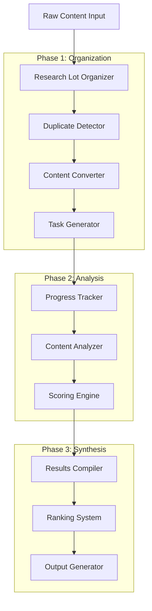

# Design Document

## Overview

The Rust Library Discovery System implements the SOPv1 methodology as a command-line tool that automates the systematic analysis of research content to identify high-PMF Rust library opportunities. The system follows a pipeline architecture with distinct phases: Organization, Analysis, and Synthesis, each with specialized components handling file management, content processing, and results compilation.

## Architecture

### High-Level Architecture



### Core Components

#### 1. Research Lot Manager
- **Purpose**: Manages the lifecycle of research lots and directory structure
- **Responsibilities**: Create/initialize research lots, maintain directory structure, provide lot metadata
- **Key Operations**: `create_lot()`, `initialize_structure()`, `get_lot_info()`

#### 2. File System Organizer
- **Purpose**: Handles file categorization and organization within research lots
- **Responsibilities**: Sort files by type, create standardized directory structure, maintain file inventories
- **Key Operations**: `categorize_files()`, `organize_by_type()`, `generate_inventory()`

#### 3. Duplicate Detection Engine
- **Purpose**: Identifies and handles duplicate content using MD5 hashing
- **Responsibilities**: Generate file hashes, detect duplicates, resolve conflicts by filename length
- **Key Operations**: `generate_hashes()`, `find_duplicates()`, `resolve_conflicts()`

#### 4. Content Conversion Pipeline
- **Purpose**: Converts various file formats to standardized .txt format
- **Responsibilities**: Handle docx, pdf, html, json, md conversions with consistent naming
- **Key Operations**: `convert_file()`, `standardize_name()`, `validate_conversion()`

#### 5. Task Generation System
- **Purpose**: Creates systematic analysis tasks for content chunks
- **Responsibilities**: Break files into 1000-line segments, generate checkbox tasks, create progress tracking
- **Key Operations**: `chunk_file()`, `generate_tasks()`, `create_progress_tracker()`

#### 6. Progress Management System
- **Purpose**: Tracks analysis progress across all files and chunks
- **Responsibilities**: Update completion status, calculate progress percentages, prevent manual editing
- **Key Operations**: `update_progress()`, `get_completion_status()`, `validate_integrity()`

#### 7. Content Analysis Engine
- **Purpose**: Processes content chunks to extract Rust library concepts
- **Responsibilities**: Filter relevant content, identify library opportunities, extract technical details
- **Key Operations**: `analyze_chunk()`, `filter_relevance()`, `extract_concepts()`

#### 8. Scoring System
- **Purpose**: Evaluates library concepts on three dimensions (PMF, Testing, Differentiation)
- **Responsibilities**: Apply scoring criteria, validate scores, maintain consistency
- **Key Operations**: `score_concept()`, `validate_scores()`, `apply_criteria()`

#### 9. Results Compilation Engine
- **Purpose**: Aggregates analysis results and prepares for ranking
- **Responsibilities**: Collect scored concepts, merge results, prepare datasets
- **Key Operations**: `compile_results()`, `merge_findings()`, `prepare_dataset()`

#### 10. Ranking and Output System
- **Purpose**: Ranks concepts and generates final reports
- **Responsibilities**: Sort by scores, categorize by ranges, generate reports
- **Key Operations**: `rank_concepts()`, `categorize_scores()`, `generate_report()`

## Components and Interfaces

### Core Data Models

#### ResearchLot
```rust
struct ResearchLot {
    id: String,
    version: String, // SOPv1, SOPv2, etc.
    created_at: DateTime<Utc>,
    base_path: PathBuf,
    status: LotStatus,
    file_counts: FileInventory,
}

enum LotStatus {
    Created,
    Organized,
    Analyzing,
    Complete,
}

struct FileInventory {
    total_files: usize,
    txt_files: usize,
    non_txt_files: usize,
    duplicates_removed: usize,
}
```

#### ContentChunk
```rust
struct ContentChunk {
    file_path: PathBuf,
    start_line: usize,
    end_line: usize,
    content: String,
    analysis_status: ChunkStatus,
    concepts_found: Vec<LibraryConcept>,
}

enum ChunkStatus {
    Pending,
    Analyzing,
    Complete,
    Skipped, // For irrelevant content
}
```

#### LibraryConcept
```rust
struct LibraryConcept {
    name: String,
    description: String,
    source_file: PathBuf,
    source_lines: (usize, usize),
    scores: ConceptScores,
    category: ConceptCategory,
}

struct ConceptScores {
    pmf_probability: u8, // 1-10
    ease_of_testing: u8, // 1-10
    differentiation_potential: u8, // 1-10
}

enum ConceptCategory {
    SystemsProgramming,
    DeveloperTools,
    PerformanceOptimization,
    WebArchitecture,
    DatabaseTools,
    SecurityTools,
    BuildSystems,
    ConcurrencyTools,
}
```

### Key Interfaces

#### FileProcessor Trait
```rust
trait FileProcessor {
    fn can_process(&self, file_path: &Path) -> bool;
    fn convert_to_txt(&self, input: &Path, output: &Path) -> Result<(), ProcessingError>;
    fn get_output_name(&self, input: &Path) -> String;
}
```

#### ContentAnalyzer Trait
```rust
trait ContentAnalyzer {
    fn is_relevant(&self, content: &str) -> bool;
    fn extract_concepts(&self, chunk: &ContentChunk) -> Vec<LibraryConcept>;
    fn score_concept(&self, concept: &LibraryConcept) -> ConceptScores;
}
```

#### ProgressTracker Trait
```rust
trait ProgressTracker {
    fn update_chunk_status(&mut self, chunk_id: &str, status: ChunkStatus) -> Result<(), TrackingError>;
    fn get_completion_percentage(&self) -> f64;
    fn get_remaining_chunks(&self) -> Vec<String>;
    fn validate_integrity(&self) -> Result<(), ValidationError>;
}
```

## Data Models

### File System Structure
```
ResearchLot##/
├── TxtInput##/           # Analysis-ready .txt files
├── NonTxtInput##/        # Original files preserved
├── Progress##/           # Tracking files (use-case-analysis.md)
├── Output##/            # Results (use-case-YYYYMM.md)
└── Duplicates##/        # Moved duplicate files
```

### Progress Tracking Format
```markdown
# Use Case Analysis Progress

## Summary
- Total Files: 111
- Completed Chunks: 45
- Remaining Chunks: 67
- Progress: 40.2%

## File Analysis
#### filename.txt (2500 lines - Systems Programming)
- [x] Lines 1-1000: Rust memory management patterns
- [x] Lines 1001-2000: Performance optimization techniques  
- [ ] Lines 2001-2500: Concurrency patterns
```

### Output Data Format
```markdown
# Rust Library Concepts - September 2025

## High Priority (Score 8-10)
### rust-memory-profiler (PMF: 9, Testing: 8, Diff: 9)
- **Description**: Real-time memory usage profiler for Rust applications
- **Source**: performance-analysis.txt:1250-1300
- **Market Need**: Critical for production debugging

## Medium Priority (Score 6-7)
[Additional concepts...]
```

## Error Handling

### Error Categories

#### FileSystemError
- Directory creation failures
- File access permission issues
- Disk space limitations
- Path resolution problems

#### ConversionError
- Unsupported file formats
- Corrupted input files
- Encoding issues
- Large file handling

#### AnalysisError
- Content parsing failures
- Scoring inconsistencies
- Progress tracking corruption
- Validation failures

### Error Recovery Strategies

#### Graceful Degradation
- Skip corrupted files and continue processing
- Provide partial results when complete analysis fails
- Maintain progress even with individual chunk failures

#### Validation and Rollback
- Validate file integrity before processing
- Checkpoint progress at regular intervals
- Provide rollback capability for failed operations

#### User Feedback
- Clear error messages with actionable guidance
- Progress indicators during long-running operations
- Detailed logging for debugging purposes

## Testing Strategy

### Unit Testing Approach

#### Component Isolation
- Mock file system operations for deterministic testing
- Test each scoring dimension independently
- Validate progress tracking accuracy

#### Test Data Management
- Create synthetic research lots with known content
- Use controlled duplicate scenarios
- Test with various file formats and sizes

### Integration Testing

#### End-to-End Workflows
- Complete research lot processing pipeline
- Multi-lot scenario testing
- Progress persistence across sessions

#### Performance Testing
- Large file handling (>10MB files)
- High file count scenarios (>1000 files)
- Memory usage optimization validation

### Acceptance Testing

#### SOPv1 Compliance
- Verify adherence to terminal-only execution requirement
- Validate scoring criteria implementation
- Confirm output format compliance

#### User Workflow Testing
- Research lot creation and organization
- Analysis progress tracking
- Results compilation and ranking

### Test Automation

#### Continuous Integration
- Automated test suite execution
- Performance regression detection
- Cross-platform compatibility testing

#### Test Data Generation
- Synthetic content generation for testing
- Automated duplicate creation for deduplication testing
- Score validation with known good examples