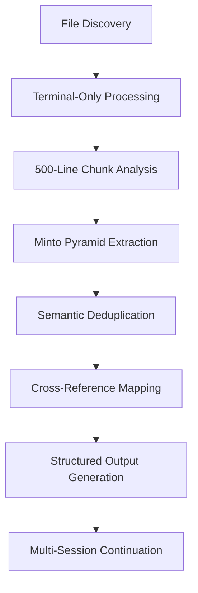

# Document Processing Master Plan - 2025-09-20

## Summary
This document contains the Standard Operating Procedures (SOP) for processing all repository files and a comprehensive progress checklist for extracting high-quality insights using the Minto Pyramid Principle for Open Source Software development in Rust.

---

# Section 1: Standard Operating Procedures by File Type

## Advanced Processing Methodology
**Core Mandate:** Extract the most important insights, observations, logic, and meta-patterns from each file for creating Open Source Software using Rust. Apply Minto Pyramid Principle to identify HQ pieces that stick to OSS Rust constraints.

### Exhaustive & Mechanical Processing Requirements
**CRITICAL:** The process must be exhaustive and mechanical to ensure complete coverage:
- **Scope:** Every single `.txt`, `.json`, `.md`, `.ipynb`, `.sh`, `.db`, and `.log` file in the entire repository must be processed
- **Reading Method:** Files must *only* be read in sequential, non-overlapping 1000-line chunks using terminal commands (`head`, `tail`)
- **Progress Tracking:** Maintain detailed checklist in this document. Update progress after each 1000-line chunk is processed and concepts are extracted
- **File Handling:** Files that cannot be read (e.g., binary files, unreadable formats) will be noted as skipped

### Minto Pyramid Summary Table Generation
**Final Goal:** Generate one cohesive, high-quality Minto Pyramid summary table with all extracted insights following this exact format:

| Conclusion | Key Line | Logic Flow | Category | Priority | Source |
|------------|----------|------------|----------|----------|--------|
| [Main takeaway] | [Supporting evidence] | [Reasoning process] | [Architecture/Performance/Safety/etc] | [High/Medium/Low] | [File:Chunk] |

### Terminal-Only Processing Philosophy
**CRITICAL:** All file processing MUST use terminal commands only. No direct file reading in code. Use `head`, `tail`, `grep`, `wc`, and other terminal tools for all extraction operations.

### Universal Processing Steps (All File Types)
1. **File Discovery & Analysis:**
   ```bash
   find . -name "*.md" -type f | wc -l        # Count markdown files
   find . -name "*.json" -type f | wc -l      # Count JSON files
   find . -name "*.txt" -type f | wc -l       # Count text files
   wc -l <filename>                          # Get line count for chunking
   ```

2. **ULTRA-THINK Analysis Phase:**
   **CRITICAL:** Before extracting any insights, apply the ultra-think prompts to ensure deep analysis:
   - **Why is this insight significant beyond surface level?**
   - **How does this connect to other insights across documents?**
   - **What deeper pattern or principle is being revealed?**
   - **Is this truly unique or just repackaged common knowledge?**
   - **What would make this insight actionable and valuable?**
   - **Does this represent a fundamental truth or just superficial observation?**

3. **Information Routing Decision:**
   **ROUTE TO APPROPRIATE OUTPUT FILE - NEVER CREATE NEW DOCUMENTS:**
   ```
   IF (Rust, OSS development, implementation, tools, CLI, storage, architecture, performance)
      → rust-oss-concepts.md

   ELSE IF (CS theory, algorithms, systems design, research, academic, technical foundations)
      → cse-concepts.md

   ELSE IF (life, business, productivity, psychology, creativity, health, personal insights)
      → life-patterns-observations.md
   ```

---

## Session Recovery & Progress Tracking

### Quick Recovery Commands
**Use these commands at start of any session to assess current state:**
```bash
# Check overall progress
grep -c "\[x\]" A01SummaryProgress20250920.md    # Completed files
grep -c "\[ \]" A01SummaryProgress20250920.md     # Remaining files
grep -c "CONCLUSION.*:" A01SummaryProgress20250920.md  # Extracted insights

# Find last processed file (search backwards from bottom)
tac A01SummaryProgress20250920.md | grep -m 1 "\[x\]"

# Generate current snapshot for detailed analysis
./generate-document-snapshot.sh

# View current processing status
cat .github/file-snapshots/current-snapshot.md | head -30

# Check recent progress changes
tail -20 .github/file-snapshots/change-log.md
```

### Session Checkpoint
**Last Updated:** [Date - fill in as you process]
**Last Processed File:** [File path - update after each file]
**Last Line Range:** [Lines processed, e.g., "1-1000" or "1001-2000"]
**Next Action:** [Next file or remaining line ranges in current file]

### Minimal Continuity Protocol
1. **At Session Start:** Run recovery commands to assess state
2. **Identify Next Action:** Find first unchecked file or continue partial file
3. **Update Checkpoint:** Modify this section after each file/chunk
4. **Resume Processing:** Continue from exact stopping point

---
*This minimalist session management ensures seamless multi-session handoff without adding complexity.*

2. **Line-Based Task Breakdown:**
   ```bash
   # Get total lines and create subtasks
   wc -l <filename>                          # Total lines in file
   chunks=$(((lines + 999) / 1000))          # Number of 1000-line chunks

   # Process each chunk as a separate subtask
   sed -n '1,1000p' <filename>              # Lines 1-1000
   sed -n '1001,2000p' <filename>            # Lines 1001-2000
   sed -n '2001,3000p' <filename>            # Lines 2001-3000
   # Continue pattern until end of file
   ```

3. **High-Quality Backlog Management:**
   - **Capture Rule:** Any high-quality insight gets backlogged, regardless of domain
   - **Format:** `[Date] [Insight] [Source:File:Lines] [Domain]`
   - **Triage:** Is this insight valuable? → Backlog it for later review
   - **Focus:** Maintain Rust/OSS/CSE focus while preserving all high-quality insights

4. **Content Extraction Commands:**
   ```bash
   # Extract URLs from any file
   grep -oE 'https?://[^[:space:])\\]\\}>\"]+' <filename>

   # Extract specific patterns (Rust-related terms)
   grep -i -E "(rust|tokio|async|await|memory|safety|performance)" <filename>

   # Count occurrences of key concepts
   grep -c "RustHallows" <filename>
   ```

4. **Minto Pyramid Extraction:** For each chunk, extract into MD table format:
   - **Conclusion:** Main takeaway
   - **Key Line:** Supporting evidence
   - **Logic Flow:** Reasoning process
   - **Category:** OSS Rust relevance
   - **Priority:** High/Medium/Low
   - **Source:** File:Chunk reference

5. **Quality Filtering:** Focus on actionable, Rust-specific, high-impact insights

### Multi-Level Analysis Framework

#### Level 1: Descriptive Coding (What is being discussed?)
- **Technical Architecture**: OS design, kernel types, scheduling algorithms
- **Performance Metrics**: Latency, throughput, resource utilization
- **Implementation Details**: Code patterns, API designs, system interfaces
- **Business Context**: Market analysis, competitive positioning, use cases

#### Level 2: Interpretive Coding (How does it work?)
- **Causal Relationships**: X enables Y, A causes B performance improvement
- **Trade-offs**: Performance vs complexity, safety vs speed
- **Dependencies**: Component interactions, prerequisite technologies
- **Evolution Patterns**: How concepts develop across documents

#### Level 3: Pattern Coding (Why is this significant?)
- **Innovation Themes**: Novel approaches, paradigm shifts
- **Recurring Problems**: Common challenges across domains
- **Solution Archetypes**: Reusable architectural patterns
- **Strategic Implications**: Market differentiation, competitive advantages

### Semantic Deduplication Strategy
- **No Source Attribution**: Focus purely on capturing concepts, not tracking origins
- **Concept Merging**: Combine similar ideas from multiple sources
- **Cross-Reference Mapping**: Link related concepts across categories
- **Hierarchy Building**: Organize concepts from specific to abstract

## File Type Specific SOPs

### 1. Markdown Files (.md) - Primary Content
**Processing Priority:** HIGH
**Count:** ~190 files

**Advanced Processing Approach:**
```bash
# Terminal commands for markdown processing
find . -name "*.md" -type f | sort > md_files_list.txt

# Process each file using terminal-only approach
for file in $(cat md_files_list.txt | head -10); do
  echo "Processing: $file"
  lines=$(wc -l < "$file")
  chunks=$(((lines + 499) / 500))

  for ((i=1; i<=chunks; i++)); do
    start=$(((i-1)*500 + 1))
    end=$((i*500))
    echo "  Chunk $i: lines $start-$end"

    # Extract chunk content using terminal commands
    if [ $i -eq 1 ]; then
      head -500 "$file"
    else
      head -$((i*500)) "$file" | tail -500
    fi
  done
done

# Extract URLs from all markdown files
find . -name "*.md" -exec grep -oE 'https?://[^[:space:])\\]\\}>\"]+' {} \; | sort -u
```

**Content Analysis Strategy:**
- **Technical Documents:** Extract architecture patterns, performance insights, safety considerations using pattern matching
- **Research Analysis:** Focus on methodologies, findings, and actionable recommendations
- **Project Documentation:** Identify key decisions, constraints, and technical approaches
- **LLM Responses:** Extract validated insights, ignore conversational fluff

**Key Focus Areas:**
- Rust OS development patterns
- Performance optimization techniques
- Safety-critical system design
- Memory management strategies
- Concurrency patterns
- Tooling and build systems

**Quality Metrics:**
- Extract 3-5 high-quality insights per 500-line chunk
- Maintain semantic deduplication across all markdown files
- Focus on actionable, implementation-ready concepts
- Cross-reference related concepts across documents

### 2. JSON Files (.json) - Structured Data
**Processing Priority:** MEDIUM
**Count:** ~60 files

**Advanced Processing Approach:**
```bash
# Terminal commands for JSON processing
find . -name "*.json" -type f | sort > json_files_list.txt

# Process JSON files using terminal tools
for file in $(cat json_files_list.txt); do
  echo "Processing JSON: $file"

  # Extract specific JSON fields using grep patterns
  grep -o '"insights":\[[^]]*\]' "$file" 2>/dev/null || echo "No insights array found"
  grep -o '"conclusions":\[[^]]*\]' "$file" 2>/dev/null || echo "No conclusions array found"
  grep -o '"findings":\[[^]]*\]' "$file" 2>/dev/null || echo "No findings array found"

  # Extract string values for key concepts
  grep -o '"[^"]*":\s*"[^"]*"' "$file" | grep -E "(insight|conclusion|finding|pattern|performance)" | head -10

  # Count total lines for chunking if needed
  lines=$(wc -l < "$file")
  if [ $lines -gt 500 ]; then
    echo "  Large JSON file ($lines lines), processing in chunks"
    # Process large JSON files in chunks
    for ((i=1; i<=((lines + 499) / 500); i++)); do
      if [ $i -eq 1 ]; then
        head -500 "$file" | grep -o '"[^"]*":\s*"[^"]*"'
      else
        head -$((i*500)) "$file" | tail -500 | grep -o '"[^"]*":\s*"[^"]*"'
      fi
    done
  fi
done
```

**Content Analysis Strategy:**
- **LLM Response Data:** Extract structured insights, filter out metadata using pattern matching
- **Configuration Files:** Identify build patterns, dependency strategies
- **Analysis Results:** Focus on conclusions and supporting data
- **Concept Lists:** Extract high-value technical concepts

**Processing Method:**
- Parse JSON structure using terminal tools to identify key-value pairs
- Extract arrays of concepts or findings using grep patterns
- Focus on fields containing: "insights", "conclusions", "findings", "patterns"
- Ignore technical metadata and timestamps
- Use `jq` if available for more complex JSON parsing

**Quality Metrics:**
- Extract 2-4 high-quality insights per JSON file
- Focus on structured, data-backed findings
- Cross-reference with related markdown concepts
- Maintain semantic consistency across file types

### 3. Jupyter Notebooks (.ipynb) - Interactive Analysis
**Processing Priority:** MEDIUM
**Count:** 2 files

**Processing Approach:**
- **Code Cells:** Extract Rust patterns, algorithmic approaches
- **Markdown Cells:** Process as standard markdown content
- **Output Cells:** Focus on results and insights, ignore intermediate steps
- **Data Analysis:** Extract conclusions from data exploration

### 4. Text Files (.txt) - Raw Data & Notes
**Processing Priority:** MEDIUM-HIGH
**Count:** Variable

**Processing Approach:**
- **Technical Notes:** Extract code snippets, commands, and observations
- **Log Files:** Identify patterns, errors, and systematic issues
- **Summary Files:** Process as condensed insights
- **Configuration:** Extract build and deployment patterns

### 5. Shell Scripts (.sh) - Automation
**Processing Priority:** LOW
**Count:** Variable

**Processing Approach:**
- Extract build automation patterns
- Identify deployment strategies
- Note testing and CI/CD approaches
- Focus on Rust-specific tooling

### 6. Database Files (.db) - Structured Data
**Processing Priority:** LOW
**Count:** Variable

**Processing Approach:**
- Note data structure patterns
- Extract if readable as text
- Skip if binary/unreadable
- Document schema insights

### 7. Log Files (.log) - System Output
**Processing Priority:** LOW
**Count:** Variable

**Processing Approach:**
- Identify error patterns
- Extract performance metrics
- Note system behavior insights
- Focus on recurring issues

## Processing Discipline Rules

### Three-File System Discipline
**CRITICAL:** Only THREE output files exist. NEVER create new documents:

1. **rust-oss-concepts.md** - Rust development, OSS patterns, implementation
2. **cse-concepts.md** - CS theory, algorithms, systems design, research
3. **life-patterns-observations.md** - Life, business, productivity, psychology

### Information Routing Discipline
**ROUTE, DON'T ACCUMULATE:**
- Every insight MUST be routed to one of the three files
- If it doesn't fit existing categories, it's not important enough to capture
- Use the routing decision tree for every extraction
- Update the appropriate file's Minto Pyramid table immediately

### Ultra-Think Processing Discipline
**APPLY META-COGNITIVE PROMPTS TO EVERY CHUNK:**
- Why is this insight significant beyond surface level?
- How does this connect to other insights across documents?
- What deeper pattern or principle is being revealed?
- Is this truly unique or just repackaged common knowledge?
- What would make this insight actionable and valuable?

### Quality Documentation Discipline
**DOCUMENT EVERY PROCESSING DECISION:**
- Rate every chunk (1-10) in the Quality TOC
- Write 2-line summary for every chunk
- Record target output file for every chunk
- Count key insights extracted from every chunk
- Update Quality TOC immediately after processing each chunk

### No Proliferation Rule
**NEVER CREATE NEW DOCUMENTS:**
- No new steering documents
- No new category files
- No new methodology documents
- No new analysis documents
- Work within the three-file system constraint

## Quality Control Guidelines

### Inclusion Criteria
✅ **Include:**
- Direct relevance to Rust OSS development
- Actionable technical insights
- Proven patterns or methodologies
- Unique perspectives or approaches
- High-impact optimization opportunities
- Memory safety considerations
- Performance benchmarks
- Security best practices

### Exclusion Criteria
❌ **Exclude:**
- Generic business advice
- Non-Rust specific content
- Duplicate information
- Low-priority observations
- Unverified claims
- Conversational metadata
- Timestamps and version info
- Redundant background information

## Output Format Standard

### MD Table Structure
```markdown
| Conclusion | Key Line | Logic Flow | Category | Priority | Source |
|------------|----------|------------|----------|----------|--------|
| [Main takeaway] | [Supporting evidence] | [Reasoning process] | [Architecture/Performance/Safety/etc] | [High/Medium/Low] | [File:Chunk] |
```

### Categories (File-Specific)
**For rust-oss-concepts.md:**
- **Architecture:** System design, patterns, structure
- **Performance:** Speed, optimization, benchmarks
- **Safety:** Memory safety, error handling, security
- **Tooling:** Build systems, CI/CD, development tools
- **Community:** OSS strategy, collaboration, governance
- **Implementation:** Code patterns, idioms, examples

**For cse-concepts.md:**
- **Theory:** Algorithms, complexity, mathematical foundations
- **Systems:** OS concepts, distributed systems, networking
- **Security:** Cryptography, security patterns, threat models
- **Research:** Academic insights, methodologies, literature
- **Architecture:** System design, patterns, scalability
- **Optimization:** Performance analysis, efficiency improvements

**For life-patterns-observations.md:**
- **Productivity:** Workflow optimization, efficiency, time management
- **Strategy:** Business planning, competitive analysis, decision-making
- **Psychology:** Behavioral patterns, motivation, cognitive biases
- **Learning:** Skill acquisition, knowledge management, personal growth
- **Communication:** Collaboration, persuasion, clarity of expression
- **Innovation:** Creativity, problem-solving, breakthrough thinking

---

## Pipeline Architecture & Multi-Session Processing

### Processing Pipeline Overview
This document implements a systematic, terminal-only research consolidation pipeline following PRISMA-inspired methodologies:



### Multi-Session Handoff Strategy
**CRITICAL:** This enables any AI assistant to continue processing seamlessly:

#### State Recovery Commands
```bash
# Check current processing progress
find . -name "*.md" -type f | wc -l
find . -name "*.json" -type f | wc -l
find . -name "*.txt" -type f | wc -l
find . -name "*.ipynb" -type f | wc -l
find . -name "*.sh" -type f | wc -l

# Count remaining unprocessed files (check checklist below)
grep -c "\[ \]" A01SummaryProgress20250920.md
grep -c "\[x\]" A01SummaryProgress20250920.md

# Check current insights extracted
grep -c "CONCLUSION:" A01SummaryProgress20250920.md 2>/dev/null || echo "No conclusions extracted yet"
```

#### Continuation Protocol
1. **Load Current State:** Read this document for processing methodology and checklist status
2. **Check Progress:** Use terminal commands to identify remaining files and chunks
3. **Resume Processing:** Continue with next file type/chunk using exact same methodology
4. **Maintain Consistency:** Use same extraction patterns, chunking approach, and table format
5. **No Restarts:** Always continue existing work, never restart from scratch
6. **Update Progress:** Mark files/chunks as processed in checklist after completion

#### Master File Processing Status
**Files must be marked with detailed progress tracking:**
- `[ ]` = Not started
- `[x]` = Complete (all chunks processed)
- `[in-progress]` = Currently being processed
- `[skipped]` = File unreadable/binary, noted as skipped
- `[partial]` = Some chunks processed, more remaining

**For each file processed, track:**
- Total number of chunks processed
- Number of insights extracted
- Any issues encountered (read errors, format issues, etc.)


---

## Content Processing Quality TOC
**Complete record of ALL processed chunks with quality ratings and routing decisions**

| File | Chunk | Lines | Quality (1-10) | 2-Line Summary | Target Output File | Key Insights Count | Processing Date |
|------|-------|-------|----------------|----------------|-------------------|-------------------|----------------|
| [File paths will be populated as processing progresses] | | | | | | | |

### TOC Instructions:
1. **Rate EVERY chunk** after processing (1-10 scale)
2. **Write 2-line summary** explaining core value and significance
3. **Record target output file** based on routing decision tree
4. **Count key insights** extracted from each chunk
5. **Include ALL chunks** regardless of quality - no filtering during processing
6. **Update TOC** after each chunk is processed
7. **Use for future quality-based decisions** and content elimination

### Quality Rating Guidelines:
- **10 (Revolutionary):** First-of-its-kind insights, paradigm shifts
- **8-9 (Exceptional):** Highly unique, valuable innovations
- **6-7 (Very Good):** Solid insights with clear value
- **4-5 (Good):** Useful but common or superficial insights
- **1-3 (Low Quality):** Common knowledge, generic observations, little value

### Summary Writing Guidelines:
- **Line 1:** What is the core insight/finding of this chunk?
- **Line 2:** Why does it matter and what makes it valuable?

---

# Section 2: Progress Checklist for Document Processing Tasks

## Files by Directory

### Line-Based Task Breakdown Instructions
**For each file, create atomic subtasks for every 1000-line chunk:**
1. **Get line count:** `wc -l filename`
2. **Calculate chunks:** `chunks = ((lines + 999) / 1000)`
3. **Create subtasks:** File-1.1 (lines 1-1000), File-1.2 (lines 1001-2000), etc.
4. **Track progress:** Mark each subtask as [x] when completed

### Example: Large File Breakdown
**File:** A01SummaryProgress20250920.md (783 lines = 1 chunk)
- **Task 1.1:** Lines 1-783 - Complete file processing (1000-line chunk method)

**Terminal commands for processing:**
```bash
# Calculate chunks
wc -l A01SummaryProgress20250920.md  # 783 lines
chunks=$(((783 + 249) / 250))        # 4 chunks

# Process each chunk
sed -n '1,250p' A01SummaryProgress20250920.md    # Task 1.1
sed -n '251,500p' A01SummaryProgress20250920.md  # Task 1.2
sed -n '501,750p' A01SummaryProgress20250920.md  # Task 1.3
sed -n '751,783p' A01SummaryProgress20250920.md  # Task 1.4
```


## Total Files Count
Total files identified: 346 files

## Notes
- This checklist was generated on September 20, 2025
- Files are organized by directory for better navigation
- All file paths are relative to the repository root
- Git system files (.git directory) are excluded from this checklist

---

# Section 3: Extracted Insights & Minto Pyramid Summary Table

## Processing Log
*Last Updated:* [Date - to be filled as processing progresses]
*Total Files Processed:* [Count - to be updated]
*Total Insights Extracted:* [Count - to be updated]

## Minto Pyramid Summary Table

| CONCLUSION | KEY LINE | LOGIC FLOW | CATEGORY | PRIORITY | SOURCE |
|------------|----------|------------|----------|----------|--------|
| [Insights will be populated here as files are processed] | [Supporting evidence] | [Reasoning process] | [Architecture/Performance/Safety/Tooling/Community/Business/Research] | [High/Medium/Low] | [File:Chunk] |

## Processing Statistics
- **Total Chunks Processed:** [Count]
- **Average Insights per Chunk:** [Ratio]
- **Files Completed:** [Count]
- **Files Remaining:** [Count]
- **Processing Efficiency:** [Percentage]%

## Quality Control Notes
- [ ] All extracted insights follow Minto Pyramid structure
- [ ] High-priority items focus on actionable OSS Rust concepts
- [ ] Medium-priority items include valuable but non-critical insights
- [ ] Low-priority items are reference material or supporting context
- [ ] Source tracking maintains File:Chunk format for traceability
- [ ] Categories align with OSS Rust development constraints
- [ ] Semantic deduplication applied across all extracted insights

### Process Improvement Protocol
**CRITICAL:** During processing, if you encounter insights or patterns that could improve this SOP itself:

1. **Pause Processing:** Immediately stop the current file/chunk processing
2. **Document the Insight:** Add the improvement idea to this section with format:
   ```
   [Date] IMPROVEMENT IDEA: [Brief description of the improvement]
   Source: [File:Chunk where discovered]
   Impact: [How this would improve the SOP]
   ```
3. **Alert Developer:** Ask the developer to review and implement the improvement
4. **Resume Processing:** Only continue after the SOP has been updated and the improvement is implemented

#### Current Improvement Candidates:
*(This section will be populated as improvement opportunities are discovered during processing)*

---

# Section 4: High-Quality Backlog

## High-Quality Insights Backlog
*Captured valuable insights regardless of domain for future exploration*

### Format
```
[Date] [Insight] [Source:File:Lines] [Domain]
```

### Current Backlog Entries
*(This section will be populated as high-quality insights are discovered during processing)*

---

### Backlog Management Rules
1. **Capture Any High-Quality Insight:** Regardless of domain or relevance to current task
2. **Use Exact Format:** Include date, insight, source (File:Lines), and domain
3. **No Filtering During Capture:** Preserve value first, organize later
4. **Review Periodically:** Assess backlog items for potential integration or separate exploration

### Domain Categories & Triage Protocol
**Primary Domains (Integrate into main insights table):**
- **Rust/OSS/CSE:** Core focus - Rust patterns, OSS development, computer science engineering
- **Document Processing:** Methodologies, tools, and techniques for document analysis

**Secondary Domains (Separate exploration):**
- **Business/Strategy:** Product development, market analysis, business models
- **Technical/Architecture:** System design, patterns, infrastructure beyond current scope
- **Research/Academic:** Deep research topics, theoretical foundations, academic insights
- **Personal/Productivity:** Workflow optimization, personal development, productivity hacks
- **General/Other:** Miscellaneous high-quality insights that don't fit other categories

### Backlog Quality Criteria - Unique Ideas Focus
**Capture ONLY if it passes ALL uniqueness tests:**

#### **Uniqueness Tests**
- ✅ **Novelty Test:** Is this a truly original perspective or just rewording common knowledge?
- ✅ **Specificity Test:** Is it specific and actionable rather than vague and general?
- ✅ **Value Test:** Does it solve a real problem in a new way or provide significant advantages?
- ✅ **Uniqueness Test:** Have you seen this exact insight before? Is it truly original?

#### **The Four Critical Questions**
Before capturing ANY insight, ask:
1. **"So what?"** - Does this actually change anything meaningful?
2. **"Who cares?"** - Would anyone find this genuinely valuable?
3. **"What's new?"** - Is this truly original or just recycled knowledge?
4. **"How is this different?"** - What makes this unique from existing approaches?

#### **CAPTURE (Score 5-10) If:**
- ✅ **Revolutionary (9-10):** First-of-its-kind approach, creates entirely new category
- ✅ **Highly Unique (7-8):** Innovative framework, novel combination of existing concepts
- ✅ **Uncommon Insight (5-6):** Non-obvious connection, counterintuitive observation, subtle pattern, "why didn't I think of that?" moment
- ✅ **Useful Observation (3-4):** Specific implementation detail rarely documented, context-dependent insight, practical nuance

#### **SKIP (Score 1-2) If:**
- ❌ **Common knowledge** or well-established facts
- ❌ **Generic advice** without specific, actionable details
- ❌ **Obvious observations** that anyone in the field would know
- ❌ **Repackaged ideas** without meaningful new perspective
- ❌ **Vague concepts** without concrete applications
- ❌ **Directly relevant to current Rust/OSS/CSE focus** (should go in main table)

#### **VALUABLE SUBTLE INSIGHTS TO CAPTURE:**
- **Non-obvious patterns** that reveal deeper truths
- **Counterintuitive findings** that challenge assumptions
- **Specific implementation nuances** that are rarely documented
- **Context-dependent insights** valuable in specific situations
- **Well-articulated common knowledge** that's particularly useful
- **"Aha!" moments** that provide practical value

### Backlog Processing Workflow - Unique Ideas Focus
1. **During Processing:** When you encounter an insight outside Rust/OSS/CSE domain, apply uniqueness tests BEFORE capturing
2. **Immediate Filtering:** Use the Four Critical Questions to filter out non-unique insights in real-time
3. **Daily Review:** At end of each session, review backlog entries and remove any that don't meet uniqueness criteria
4. **Weekly Synthesis:** Group related unique insights and identify groundbreaking themes
5. **Monthly Assessment:** Evaluate truly unique insights for potential integration or separate exploration projects

### Enhanced Backlog Format
```
[Date] [Unique Insight] [Source:File:Lines] [Domain] [Uniqueness Score: 1-10]
```
Where uniqueness score reflects:
- **1-3:** Mildly unique - useful but not groundbreaking
- **4-6:** Moderately unique - valuable new perspective
- **7-8:** Highly unique - innovative approach or framework
- **9-10:** Revolutionary - first-of-its-kind breakthrough

### Uniqueness Validation Process
For each potential backlog entry:
1. **Self-Assessment:** Apply the Four Critical Questions honestly
2. **Cross-Reference:** Check against existing knowledge and similar insights
3. **Value Proposition:** Articulate exactly why this is unique and valuable
4. **Confidence Score:** Assign uniqueness score (1-10) with justification
5. **Peer Review:** Consider if others would recognize this as unique and valuable

### Signal-to-Noise Optimization Goals
- **Quality over Quantity:** Better to have 5 truly unique insights than 50 generic ones
- **Innovation Focus:** Prioritize insights that could enable new capabilities or approaches
- **Actionability:** Ensure unique insights can be practically applied or built upon
- **Long-term Value:** Focus on insights that remain valuable over time, not just trending topics

---
*This table will be populated systematically as each file is processed according to the methodology in Section 1. Update entries after each 250-line chunk is processed and insights are validated. PAUSE IMMEDIATELY if you discover improvements to this SOP and alert the developer.*
